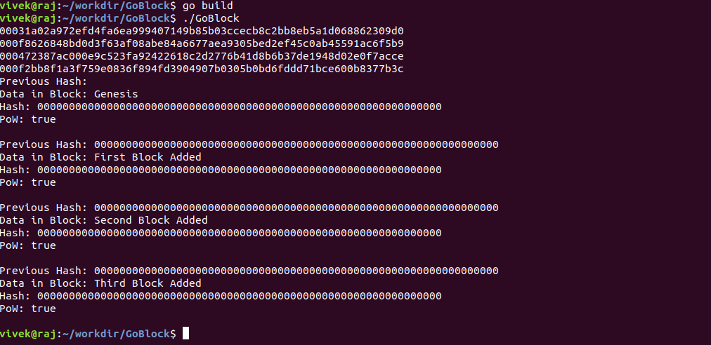

# GoBlock
A Simple Blockchain implementing PoW (Proof of Work) 
The program is written in Golong.
#### Installation

    git clone https://github.com/vivekrj0/GoBlock.git
    cd GoBlock
    go build
    ./GoBlock
##### Output

    
     
     

